# VeilExchange
--------------

## Introduction
---------------

* ___VeilExchange___ is a __Peer-to-Peer__ (__P2P__) communication platform written in __Modern C++__  which enables users to securely exchanged __encrypted messages__ and __files__ without relying on a __central server__.

## Technology Stack
-------------------
* `Modern C++`.
* Compiler: `gcc/g++ 15.1.0`.
* Developed on `Linux (Ubuntu 20.04)`.
* Developed using `MS VSCode`. Note: If you wish to edit any code yourself, any text editor will do.
* `CMake`. Note: version: `4.0.2`.
* `Boost.Asio` for `Networking`.
* The `TLS protocol` for `encryption`.
* Note: `PlantUML` was used for the ` Software Architecture Diagrams`.

## VeilExchange Architecture
---------------------------

### 1. Application Architecture
-------------------------------
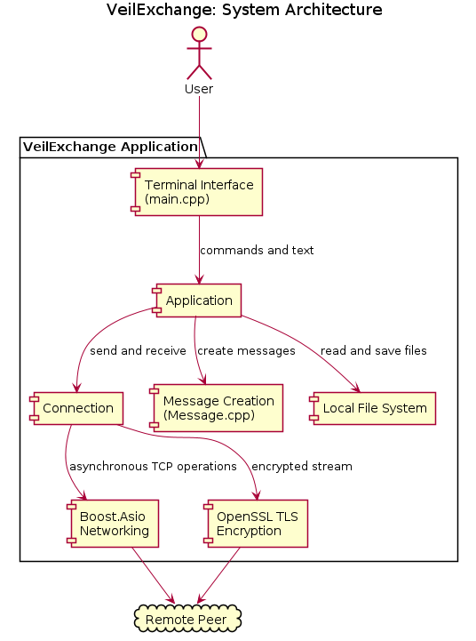

### 2. Class Diagram
--------------------
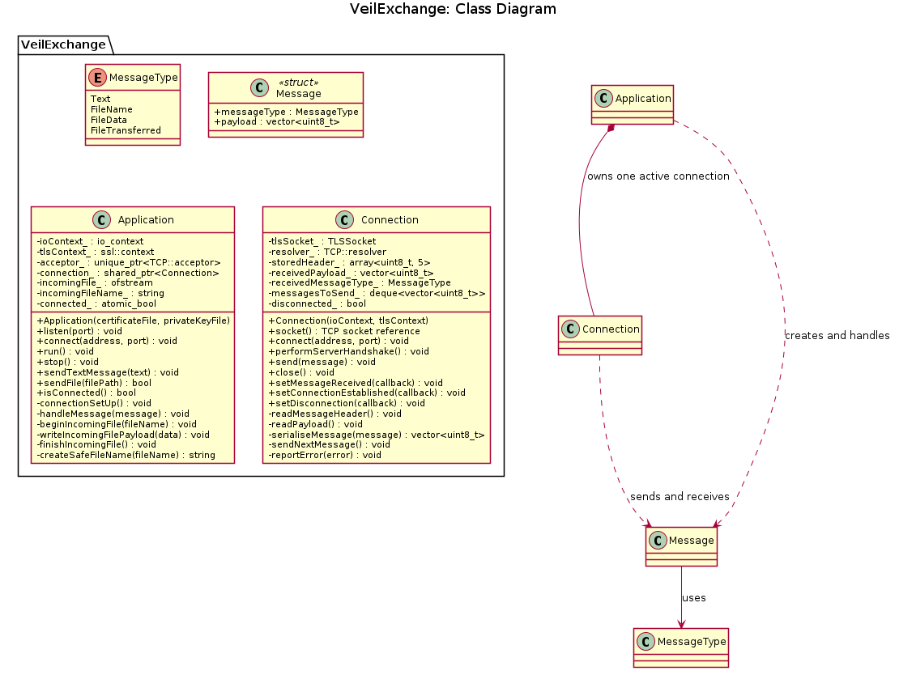

### 3. Project Structure
------------------------
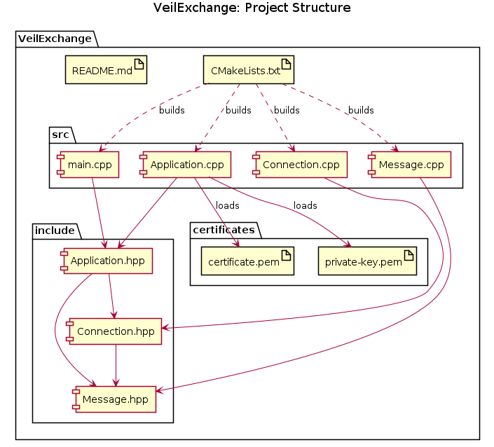
### 4. Message Sending Sequence
-------------------------------
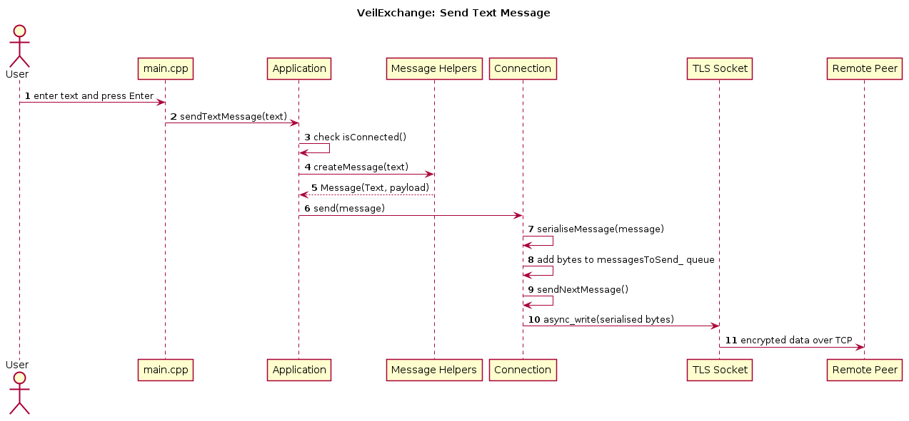
### 5. Receive Message Sequence
-------------------------------
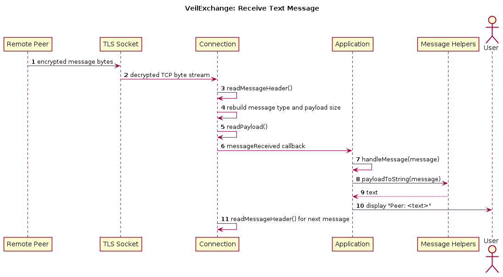
### 6. Send File Sequence
-------------------------
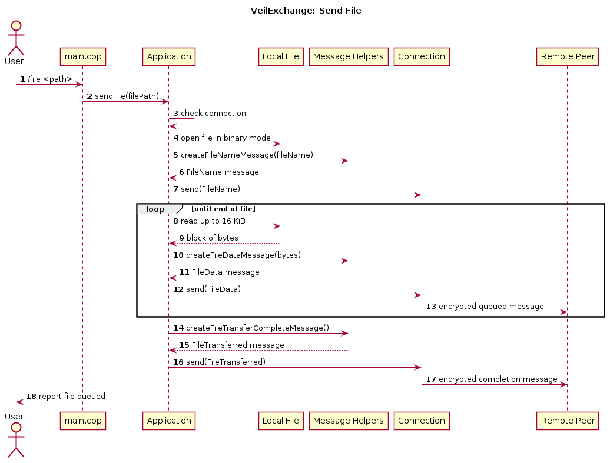
### 7. Receive Message Sequence
-------------------------------
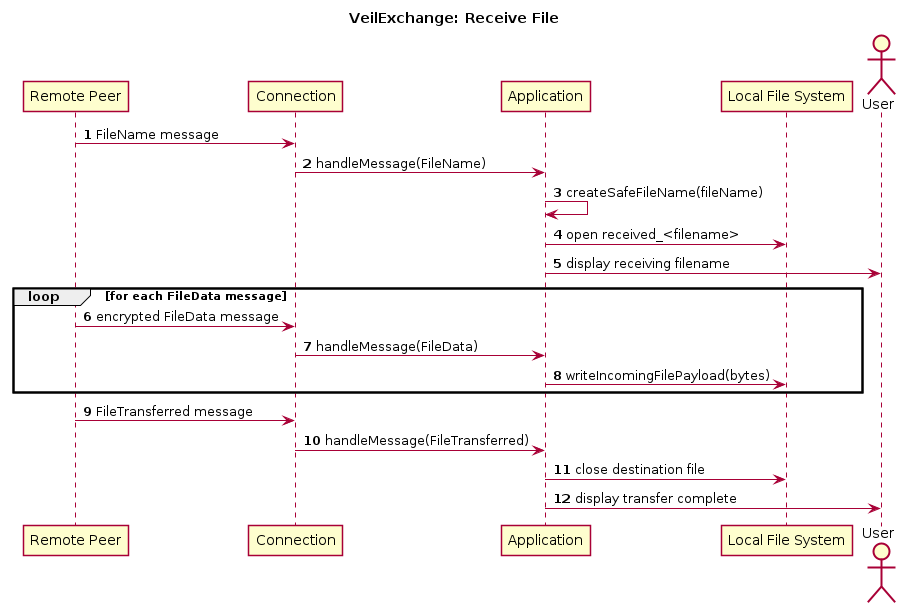
### 8. Connection State
-----------------------
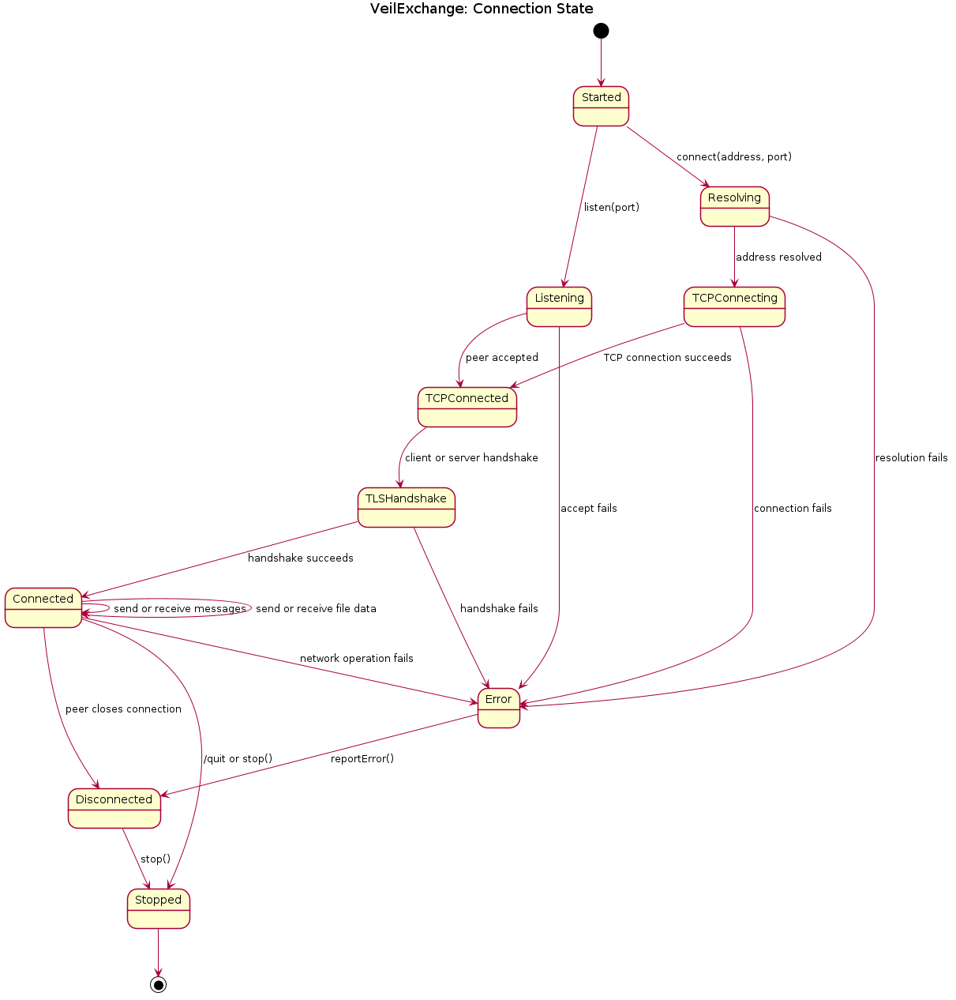
### 9. Use Case
---------------
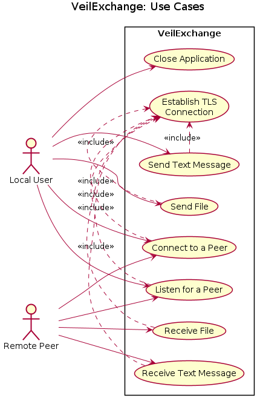
### 10. Deployment
------------------
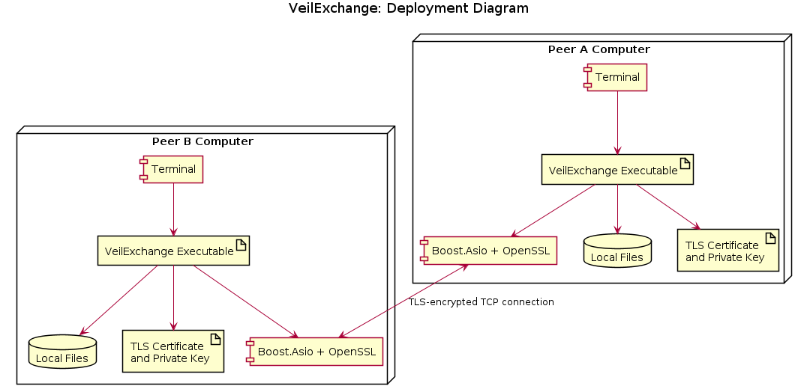
### 11. Message Protocol
------------------------
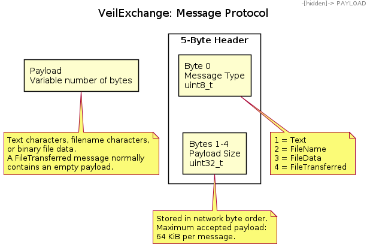
### 12. Thread Model
--------------------
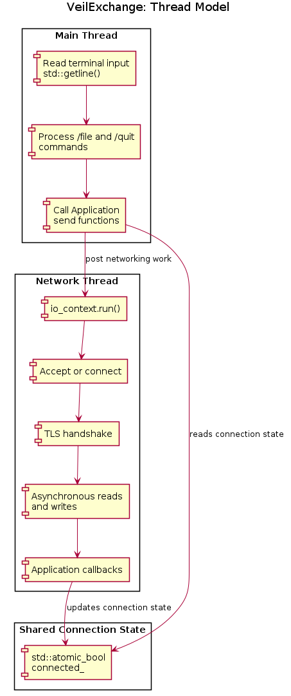

## Building the Application
---------------------------
* `$ git clone git@github.com:MRLintern/VeilExchange.git`
* `$ cd VeilExchange`
* `$ mkdir -p build && cd build`
* `$ cmake ..`
* `$ cmake --build .`
* If you want to experiment with the file, `fluid_flow.dat` file, place it inside the `build` directory.
## Running the Application
--------------------------
* In `VSCode`, split the terminal in two.
* In one terminal: `$ ./VeilExchange listen 5000`
* In the other terminal: `$ ./VeilExchange connect 127.0.0.1 5000`
* Now peers can chat.
* To send a file from 1 peer to another: `$ /file fluid_flow.dat`.
* To end the conversation/disconnect: `$ /quit`
## References
-------------

* [The C++ Alliance](https://docs.cppalliance.org/user-guide/task-networking.html).
* ___Network Programming with C++: Build Efficient Communication Systems___, by __Robert Johnson__.
* ___C++ Networking 101: Unlocking Sockets, Protocols, VPNs, and Asynchronous I/O with 75+ Sample Programs___, by __Anais Sutherland__.
* ___Boost.Asio C++ Network Programming: Enhance your Skills with Practical Examples for C++ Network Programming___, by __John Torjo__, __PACKT Publishing (Open Source)__. 
